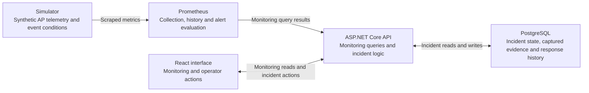

# Venue Network Operations Console

A local network-operations console for monitoring a fictional convention venue and managing incident response. Operators inspect AP and zone health, investigate recent telemetry, capture current conditions in durable incidents, and track the response through resolution.

The operator workflow is: **inspect a condition → create an incident → investigate → observe recovery → resolve**. Alerts describe technical conditions; incidents track the human response. Recovery does not automatically resolve an incident.

## Synthetic inputs, real application behavior

AP/client counts, utilization, management latency/loss, RF/controller telemetry and event conditions are **fictional, deterministic inputs**. Prometheus collection, history queries and alert evaluation; ASP.NET Core validation; PostgreSQL transactions; Blackbox HTTP probes; and browser polling and incident interactions are **real local application behavior** operating on those inputs.

The project does not contain actual Javits infrastructure, telemetry, network design, incident procedures or organizational endorsement. It makes no predictive wireless-performance or production-deployment claim.

## Capabilities and stack

- **Monitor availability and quality:** AP/zone overview, distinct Offline/Partial outage/Degraded states, separate availability and degradation alerts, and bounded AP history with explicit unobserved gaps.
- **Explore repeatable conditions:** manually hold the deterministic event profile or play it automatically over approximately 11 minutes.
- **Track incident response:** create from current affected APs, retain captured evidence separately from current telemetry, and use investigation, monitoring, resolution, reopening, notes and responder/team labels.
- **Recover safely:** bounded incident discovery, optimistic concurrency, explicit retry-safe UI commands, and separate monitoring/storage failure boundaries.

| Component | Technology |
|---|---|
| Operator interface | React, TypeScript, Vite |
| API and telemetry simulator | ASP.NET Core / .NET 10 |
| Incident persistence | PostgreSQL 18, EF Core, Npgsql |
| Monitoring | Prometheus, PromQL, Blackbox Exporter |
| Local service runtime | Docker Compose |

## Architecture



Monitoring and incident responsibilities share **one API application**. Prometheus evaluates alerts independently; the API reads their state. PostgreSQL stores incident records and response history, not a duplicate of the monitoring time series.

Blackbox probes the API's local HTTP liveness endpoint. It does not measure wireless quality. See the [detailed data boundaries and incident architecture](docs/milestone-6.md#monitoring-and-incident-architecture).

## Local development

Run commands from the repository root in a POSIX-compatible shell. Prerequisites:

- Docker Engine/Desktop with Compose and support for `--wait`.
- Maintained **Node 22.23.2** selected on `PATH`, with Corepack available; the project uses **npm 11.19.1** through Corepack.
- For first provisioning, access to the configured image/dependency registries or existing caches. The commands preserve the repository's version policy.

A host .NET SDK or `dotnet-ef` tool is not required for this container startup/migration path. Host-side backend development and checks have separate SDK/restore prerequisites.

### First provisioning

Before first database initialization, create the ignored private `.env` from [.env.example](.env.example), restrict it to mode `0600`, and replace the password placeholder with a local-only password. **Do not overwrite an existing `.env` or change the credential associated with an initialized incident-data volume.** Changing the file alone does not rotate PostgreSQL's stored password. See [database lifecycle](docs/milestone-6.md#database-lifecycle).

Build/start the five services, explicitly apply the incident migrations, and check incident readiness:

```bash
docker compose --project-name venue-network-operations-console \
  --file compose.yaml up --build --detach --wait

docker compose --project-name venue-network-operations-console \
  --file compose.yaml exec -T venue-api \
  dotnet VenueOps.Api.dll --migrate-incidents

curl --fail --silent --show-error \
  http://127.0.0.1:8080/health/ready/incidents
```

Compose checks API process liveness; successful startup does not establish incident-schema readiness. Ordinary API startup does not auto-migrate. Run the explicit migration command again after an incident schema upgrade.

Provision frontend dependencies, then start the frontend in its own terminal:

```bash
corepack npm@11.19.1 --prefix src/VenueOps.Web ci

corepack npm@11.19.1 --prefix src/VenueOps.Web run dev -- \
  --host 127.0.0.1 --port 5173 --strictPort
```

Open <http://127.0.0.1:5173>. Application host ports bind to IPv4 loopback; PostgreSQL has no host publication. Incident data and Prometheus history use separate named volumes.

### Subsequent starts

With images, frontend dependencies and the Corepack package manager already provisioned, credentials preserved and migrations current, start services only if needed:

```bash
docker compose --project-name venue-network-operations-console \
  --file compose.yaml up --no-build --pull never --detach --wait

curl --fail --silent --show-error \
  http://127.0.0.1:8080/health/ready/incidents
```

Start the frontend in its own terminal without reinstalling dependencies:

```bash
COREPACK_ENABLE_NETWORK=0 \
corepack npm@11.19.1 --prefix src/VenueOps.Web run dev -- \
  --host 127.0.0.1 --port 5173 --strictPort
```

The environment flag disables Corepack package-manager downloads; it does not disable application networking.

The [event demo](docs/milestone-5.md#how-to-demo) and [incident demo](docs/milestone-6.md#how-to-demonstrate) explain the existing controls and state changes. **Interactive incident creation writes durable records. Simulator reset and incident resolution do not delete them.** The documented isolated verifier is a separate local verification workflow, not a universal quick start or an interactive capture mode.

## Verification and limitations

Run the frontend checks with maintained Node and already-provisioned dependencies:

```bash
COREPACK_ENABLE_NETWORK=0 corepack npm@11.19.1 --prefix src/VenueOps.Web test
COREPACK_ENABLE_NETWORK=0 corepack npm@11.19.1 --prefix src/VenueOps.Web run lint
COREPACK_ENABLE_NETWORK=0 corepack npm@11.19.1 --prefix src/VenueOps.Web run build
```

Evidence has distinct levels: deterministic/unit/component tests, Prometheus virtual-time rule tests, hosted API/PostgreSQL integration, rendered-browser observation, and infrastructure/restore checks. See the [event verification](docs/milestone-5.md#dated-closeout-verification) and [incident verification](docs/milestone-6.md#verification-evidence) for recorded commands, prerequisites and results. Those results retain their original dates and commit attribution; they are not fresh test results for every later checkout.

The hosted verifiers require a provisioned local environment, and some migration proofs require retained earlier API images. Their machine-specific prerequisites are documented separately from application startup. No clean-machine or cross-platform bootstrap guarantee is implied by the recorded local runs.

Intentional limits include one deterministic event profile at a fixed playback speed, process-local simulator state, no real wireless-controller integration, and no authentication or production security/deployment claim. Responder/team labels are unverified free text; chronology does not establish authenticated or tamper-proof attribution. Browser retry recovery is session-limited, and rendered verification is Chrome-only. See the full [event limitations](docs/milestone-5.md#limitations) and [incident limitations](docs/milestone-6.md#limitations), including the boundary of the disposable backup/restore proof.

## Documentation

Implementation details and historical milestone evidence:

- [Milestone 1 viability proof](docs/viability.md)
- [Milestone 2 operations overview](docs/milestone-2.md)
- [Milestone 3 access point history](docs/milestone-3.md)
- [Milestone 4 integrated verification](docs/milestone-4.md)
- [Milestone 5 event-day load and degradation](docs/milestone-5.md)
- [Milestone 6 incident triage and response](docs/milestone-6.md)
