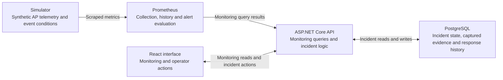

# Venue Network Operations Console

A venue-network operations console that uses synthetic access-point telemetry to demonstrate monitoring, historical analysis, deterministic degradation, and operator-managed incident response. It connects technical network conditions with durable records of investigation and resolution.

## What this demonstrates

- Prometheus-backed AP/zone monitoring and historical telemetry.
- Repeatable held-position and approximately 11-minute automatic event degradation.
- When an incident is created, the console preserves the network conditions that prompted the response while displaying current monitoring data separately.
- Durable response workflow, operator notes and chronology.
- The incident UI uses optimistic concurrency and idempotent commands to guard against stale updates and duplicate writes when actions overlap or responses are lost.
- Dependency isolation and browser request ownership.

## Architecture



Prometheus handles monitoring and time-series history, while PostgreSQL stores durable incident state, captured evidence, and response history. Both responsibilities connect through one ASP.NET Core API application.

Blackbox checks the API’s local HTTP liveness endpoint.

## Core operator workflow

Inspect a condition → create an incident → investigate → observe recovery → resolve.

## Technology stack

React · TypeScript · Vite · ASP.NET Core / .NET 10 · Prometheus / PromQL · PostgreSQL / EF Core / Npgsql · Docker Compose

## Local development

Run from the repository root in a POSIX shell. Prerequisites: Docker Engine/Desktop with Compose `--wait` support, **Node 22.23.2** on `PATH`, and Corepack for project **npm 11.19.1**. First provisioning requires registry access or populated image/package caches.

Create a private, ignored `.env` from [.env.example](.env.example), restrict permissions with `chmod 600 .env`, and replace the password placeholder. **Preserve any existing `.env` and the password used to initialize its database volume.** See [database lifecycle](docs/milestone-6.md#database-lifecycle).

Build/start services, explicitly migrate incident storage, then check readiness. Ordinary API startup does not auto-migrate:

```bash
docker compose --project-name venue-network-operations-console \
  --file compose.yaml up --build --detach --wait

docker compose --project-name venue-network-operations-console \
  --file compose.yaml exec -T venue-api \
  dotnet VenueOps.Api.dll --migrate-incidents

curl --fail --silent --show-error \
  http://127.0.0.1:8080/health/ready/incidents
```

Install frontend dependencies and start the interface in another terminal:

```bash
corepack npm@11.19.1 --prefix src/VenueOps.Web ci
corepack npm@11.19.1 --prefix src/VenueOps.Web run dev -- \
  --host 127.0.0.1 --port 5173 --strictPort
```

Open <http://127.0.0.1:5173>. For subsequent starts, follow [normal interactive use](docs/milestone-6.md#normal-interactive-use). **Interactive incidents persist after simulator reset.**

## Documentation

- [Milestone 1](docs/viability.md): viability proof.
- [Milestone 2](docs/milestone-2.md): operations overview.
- [Milestone 3](docs/milestone-3.md): AP history.
- [Milestone 4](docs/milestone-4.md): validation, request ownership, history and infrastructure safeguards.
- [Milestone 5](docs/milestone-5.md): deterministic event model, playback, alerts and demo.
- [Milestone 6](docs/milestone-6.md): incident persistence, workflow, retries, concurrency and restoration evidence.

## Verification and limitations

With maintained Node and provisioned dependencies:

```bash
COREPACK_ENABLE_NETWORK=0 corepack npm@11.19.1 --prefix src/VenueOps.Web test
COREPACK_ENABLE_NETWORK=0 corepack npm@11.19.1 --prefix src/VenueOps.Web run lint
COREPACK_ENABLE_NETWORK=0 corepack npm@11.19.1 --prefix src/VenueOps.Web run build
```

[Event verification](docs/milestone-5.md#dated-closeout-verification) and [incident verification](docs/milestone-6.md#verification-evidence) retain dated results and prerequisites for unit/component, rule, hosted, browser and infrastructure checks.

Network telemetry is generated by a deterministic simulator. Prometheus collection and rule evaluation, ASP.NET Core behavior, PostgreSQL persistence, incident workflows, concurrency/retry handling, and failure/recovery behavior run through the actual application stack. This is a portfolio implementation rather than a production network deployment.

See the detailed [event limitations](docs/milestone-5.md#limitations) and [incident limitations](docs/milestone-6.md#limitations).
