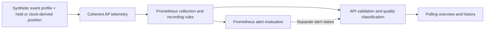

# Milestone 5 — Event-Day Load and Degradation

Milestone 5 demonstrates software engineering through a deterministic operations simulator: domain/state modeling, pure profile evaluation, virtual time, API integration, asynchronous presentation, and testable failure/recovery behavior. Networking and observability provide the application domain.

## What changed

The **High-Density Event Day** profile can be held at an absolute virtual minute or played automatically over approximately 11 real minutes. The simulator generates AP measurements; the API derives current quality from validated Prometheus telemetry; a separate Prometheus rule warns about sustained degradation. The existing overview and history display buildup, degraded quality, and recovery without new scenario controls.



Task 1 established the held-position vertical slice. Task 2 added lazy monotonic-clock progression using the same profile. Prometheus evaluates alerts independently; the API reads alert states and does not trigger them. Five existing simulated AP metric families carry operational state, clients, channel utilization, management latency, and management packet loss.

## Synthetic inputs and real behavior

**Deterministic synthetic telemetry models plausible relationships between client density, utilization, management latency, packet loss, and service degradation.** AP counts and measurements, event phases, and virtual load are fictional inputs. Prometheus scraping and rule evaluation, API responses, Blackbox HTTP probes, frontend polling, history queries, and local Docker networking are real application behavior operating on those inputs.

| Synthetic venue inputs | Real application and monitoring behavior |
|---|---|
| Four APs, their operational state and client counts | Prometheus collection and recording-rule evaluation |
| Channel utilization, management latency and management packet loss | Alert pending/firing/clear transitions and ASP.NET API behavior |
| Event phases and virtual load | Blackbox HTTP probing, browser polling and historical queries |
| Deliberately controlled degradation/offline scenarios | Local Docker networking and application failure/recovery handling |

API quality classification is real domain logic applied to synthetic measurements. Blackbox measures an actual local HTTP request; it does not measure wireless quality.

This project does not contain actual Javits telemetry, controller data, AP/client counts, attendance, RF characteristics, congestion thresholds, or venue capacity measurements. It does not predict Wi-Fi performance or model a real venue's infrastructure.

## Event model

| Phase | Virtual minute | Load knot | Automatic offset |
|---|---:|---:|---:|
| PRE_OPEN | 0 | 0 | 0:00 |
| ARRIVAL | 150 | 0.25 | 2:30 |
| BUILDING_LOAD | 240 | 0.50 | 4:00 |
| PEAK_DENSITY | 360 | 1.00 | 6:00 |
| RECOVERY | 480 | 1.00 | 8:00 |
| EVENT_CLOSE | 660 | 0 | 11:00 |

Load is linearly interpolated between knots. PRE_OPEN already contains a low-load ramp. Maximum load remains flat from minute 360 through the beginning of RECOVERY at minute 480, then falls to zero at 660. Virtual event labels describe scenario position, not monitoring timestamps.

Every measurement is calculated from an immutable AP baseline plus the current load; it never accumulates the previous phase's measurements. Zone A contains ap-001/ap-002 and receives full pressure; Zone B contains ap-003/ap-004 and receives half pressure.

### Compact synthetic relationships

For an operational AP:

```text
pressure = load in Zone A; load / 2 in Zone B
clients = baselineClients × (1 + pressure), rounded to a whole client
utilization = baselineUtilization + 0.40 × pressure
latencySeconds = baselineLatency + 0.20 × max(0, utilization - 0.65)
lossRatio = baselineLoss + 0.10 × max(0, utilization - 0.80)
```

Client midpoints round away from zero. The implementation uses deterministic decimal intermediate calculations, then converts at the existing telemetry boundary. Ratios are fractions, and latency is in seconds. The [pure profile](../src/VenueOps.TelemetrySimulator/EventDayScenario.cs) and [immutable AP baselines](../src/VenueOps.TelemetrySimulator/AccessPointStateStore.cs) define the exact calculation.

These are synthetic calibration relationships, not RF capacity equations. Higher pressure increases clients and utilization; sufficiently high current utilization raises management latency and then loss. Measurements and API quality respond to current values immediately. Only alert firing requires the condition to persist.

## Availability versus degradation

The API applies this inclusive predicate after validating required telemetry:

```text
operational
AND utilization >= 0.80
AND (management latency >= 0.050 seconds OR management packet loss >= 0.010)
```

| AP condition | Meaning |
|---|---|
| Operational + healthy quality | Available, below the combined degradation condition |
| Operational + degraded quality | Available, but the synthetic quality condition is satisfied |
| Offline | Unavailable; takes precedence over degraded quality |

Offline APs have zero clients and unavailable utilization/latency/loss measurements. Unavailable measurements remain distinct from numeric zero; missing or invalid required operational telemetry goes through the existing validation/error boundary.

Zone presentation first reports an availability problem when `operationalRatio < 1`; otherwise it reports Degraded when `degradedAccessPoints > 0`, and Healthy otherwise. Operational ratio continues to describe availability, not quality. Under the default event, Zone A degrades while Zone B remains healthy, with all four APs operational.

| Alert | Meaning | Required duration | Labels |
|---|---|---:|---|
| VenueApDown | Availability failure | 10 seconds | `severity: critical`, `telemetry_source: simulated` |
| VenueApDegraded | Sustained quality degradation | 30 seconds | `severity: warning`, `telemetry_source: simulated` |

The degradation rule uses the same predicate as the API. A condition becomes pending before it is eligible to fire; recovery clears it after normal collection/evaluation. Pending or firing degradation does not mean the AP is offline. The [API policy](../src/VenueOps.Api/AccessPointDegradation.cs) and [Prometheus rules](../infrastructure/prometheus/rules/venue.rules.yml) have matching boundary tests.

History shows Offline before Degraded before Healthy; Not observed remains neutral. Its **State changes** summary counts adjacent operational availability transitions, not Healthy ↔ Degraded quality changes.

### Deterministic threshold crossings

| Event | Virtual minute | Deterministic playback offset |
|---|---:|---:|
| ap-001 first degraded | 276 | 4:36 |
| ap-002 first degraded | 324 | 5:24 |
| ap-002 first recovered | 508 | 8:28 |
| ap-001 first recovered | 544 | 9:04 |

BUILDING_LOAD represents rising pressure, so degradation begins before the maximum-load PEAK_DENSITY plateau. These are model offsets, not exact hosted Prometheus alert timestamps. Five-second scraping/evaluation and the 30-second warning duration introduce observable delay.

## Automatic playback and controls

**One real second represents one virtual minute.** The 660-minute illustrative event therefore takes approximately 11 real minutes at a fixed 60× virtual rate:

```text
virtual minute = min(660, floor(monotonic elapsed seconds))
```

Start records a monotonic timestamp through .NET `TimeProvider`. Each status/metrics snapshot lazily resolves the current position from elapsed time, once for that logical snapshot. Calendar-clock corrections do not determine progression. No scheduler or one-second background telemetry mutation loop is required. Automatic and held evaluation at the same minute produce the same profile-derived measurements.

| Mode | Meaning |
|---|---|
| baseline | No event active; minute and phase are null, load is zero |
| held | Absolute manually selected position; no automatic advancement |
| running | Position advances from the monotonic start anchor |
| completed | Automatic position reached 660 and remains clamped there |

Baseline measurements remain subject to any explicit AP offline override until healthy control, start, or reset. Automatic completion stays observable until another start, manual position, or reset. Manually holding minute 660 remains `held`, not `completed`.

Simulator controls use port 8081, separately from the application API on 8080:

| Method and path | Request | Behavior |
|---|---|---|
| `GET /simulation/event-day` | None | Coherent scenario/mode/minute/phase/load/AP snapshot |
| `POST /simulation/event-day/start` | No parameters | Fresh running minute 0; clears all overrides; restarts an existing run |
| `PUT /simulation/event-day/position` | `{"elapsedMinutes":360}` | Integer 0–660; switches to held and preserves overrides |
| `POST /simulation/event-day/reset` | No parameters | Baseline; clears event state and all overrides |
| `PUT /simulation/access-points/{apId}` | `{"scenario":"offline"}` or `{"scenario":"healthy"}` | Existing per-AP operational override |

Start is a restart command, not an idempotent operation; its response uses the new anchor and reports exact minute 0. Invalid manual positions return HTTP 400 without disturbing the existing run or overrides. Offline overrides persist across phases and completion. Healthy rejoins the **current** event position, so an AP restored at peak can immediately have degraded quality. Reset removes the old anchor completely; subsequent elapsed time cannot resume it. Repeated reset is safe.

Scenario state is process-local and non-persistent. A fresh simulator process starts baseline with no automatic resume. Controls change current synthetic state only; they do not insert historical samples, reset monitoring timestamps, or clear Prometheus data. Exact contracts are in the [simulator endpoints](../src/VenueOps.TelemetrySimulator/Program.cs).

## How to demo

Use the maintained Node 22.23.2 environment and Corepack npm 11.19.1. Run from the repository root with dependencies and images already provisioned; [initial setup](../README.md#local-development) is separate.

If the existing stack is not already healthy, start it without rebuilding or pulling:

```bash
docker compose --project-name venue-network-operations-console --file compose.yaml \
  up --no-build --pull never --detach --wait
```

In a second terminal, start the existing frontend:

```bash
corepack npm@11.19.1 --prefix src/VenueOps.Web run dev -- \
  --host 127.0.0.1 --port 5173 --strictPort
```

Open <http://127.0.0.1:5173>. Reset and inspect the baseline:

```bash
curl --fail --silent --show-error -X POST \
  http://127.0.0.1:8081/simulation/event-day/reset

curl --fail --silent --show-error \
  http://127.0.0.1:8081/simulation/event-day
```

Expect baseline mode, four healthy scenarios, clients 42/35/28/31, and no overrides. Allow normal polling/evaluation to show healthy monitoring and inactive alerts. Start once:

```bash
curl --fail --silent --show-error -X POST \
  http://127.0.0.1:8081/simulation/event-day/start
```

Watch client load rise, Zone A enter degradation, the separate warning become pending/firing, and recovery restore healthy quality. Zone B remains healthy. Inspect each AP's 15-minute history. After about 11 minutes, use GET status again to confirm `completed`, minute 660, EVENT_CLOSE, and zero load. The frontend intentionally has no scenario-control panel or completion banner.

Reset afterward, including if the demonstration is interrupted:

```bash
curl --fail --silent --show-error -X POST \
  http://127.0.0.1:8081/simulation/event-day/reset
```

Stop the temporary frontend with Ctrl+C when finished; leave the existing monitoring stack and data volume intact.

### Alternative: manual peak inspection

Use this instead of an uninterrupted automatic demo. Issuing it during playback stops progression and switches to held:

```bash
curl --fail --silent --show-error -X PUT \
  -H 'Content-Type: application/json' \
  --data '{"elapsedMinutes":360}' \
  http://127.0.0.1:8081/simulation/event-day/position
```

After collection/evaluation, expect Zone A clients 154 with two degraded APs and Zone B clients 89 with none. All four remain operational. Reset when finished.

## Monitoring time and history

Prometheus stores real monitoring/collection time. Virtual event minutes and illustrative event labels never replace those timestamps. The approximately 11-minute run therefore occupies approximately 11 minutes of real monitoring history; no samples are backfilled or fabricated.

The API's history is a Prometheus range-query result. Its timestamps are real-time evaluation positions, and lookback may reuse recently collected samples. Observation counts are not necessarily one-to-one raw scrape counts. The 15-minute window uses five-second resolution, as do current scraping, rule evaluation, and frontend polling. History cells represent query resolution, not measured state duration; missing positions remain unobserved. See the [Milestone 4 evidence boundaries](milestone-4.md#evidence-boundaries-and-limitations).

## Dated closeout verification

Verification date: **September 12, 2026 (UTC)**. Implementation baseline: `9c27d23131e61da60d90e167ccc9cb1a2e235bf5` (`feat: add automatic event-day playback`), following held-position checkpoint `ec9c5f3b5f654795cf9bbf7c427c45781769bd93`. The starting branch was main with a clean working tree. This closeout changed documentation only.

The maintained environment was Node 22.23.2, project npm 11.19.1 through Corepack, ordinary npm 10.9.8, and host .NET SDK 10.0.400. Container SDK configuration remained 10.0.401; both running application containers reported .NET runtime 10.0.12. Prometheus remained 3.13.3 and Blackbox Exporter 0.28.0. Dependencies and image pins were unchanged.

### Regression and rule checks

| Gate | Closeout result |
|---|---|
| Backend API suite | 114 passed; none failed or skipped |
| Backend simulator suite | 97 passed; none failed or skipped |
| Backend total | **211 passed** |
| Frontend component/API suites | **95 passed**; none failed or skipped |
| Frontend lint and production build | Passed |
| Prometheus configuration and rules | Valid configuration; four rules validated |
| Milestone 5 virtual-time rule fixture | **27 assertions / 3 groups passed**: 15 alert assertions and 12 expression assertions |

The rule fixture checks matching degradation-policy boundaries, offline precedence, pending before 30 seconds, sustained firing, interrupted persistence, and recovery. These virtual-time checks establish exact rule behavior; hosted observation times below include collection and polling alignment.

The closeout reuses the existing verifiers rather than creating another playback implementation:

```bash
dotnet test VenueNetworkOperationsConsole.sln --no-restore
corepack npm@11.19.1 --prefix src/VenueOps.Web test
corepack npm@11.19.1 --prefix src/VenueOps.Web run lint
corepack npm@11.19.1 --prefix src/VenueOps.Web run build
```

Promtool configuration/rule checks ran inside the existing Prometheus service. The unchanged [Milestone 5 fixture](../tests/milestone5/venue.rules.test.yml) ran in a temporary container using the already-present `prom/prometheus:v3.13.3` image, `--pull never`, no network, and a read-only repository mount. It had no Prometheus data-volume mount and was removed afterward.

For hosted verification, `VENUE_CLOSEOUT_EVIDENCE` identifies a fresh temporary directory outside the repository. The held verifier needs the existing stack; full playback additionally needs the frontend at 127.0.0.1:5173, maintained Node 22, and installed Chrome. The playback verifier creates its own temporary Chrome profile; `VENUE_CHROME_PATH` can select the installed executable.

```bash
VENUE_CLOSEOUT_EVIDENCE="$(mktemp -d "${TMPDIR:-/tmp}/venueops-m5-closeout.XXXXXX")"
bash tests/milestone5/verify.sh --evidence-dir "$VENUE_CLOSEOUT_EVIDENCE/held"
bash tests/milestone5/verify-playback.sh --mode full \
  --evidence-dir "$VENUE_CLOSEOUT_EVIDENCE/automatic"
```

Both register reset cleanup before scenario mutation. Full mode runs one uninterrupted event, checks completed-state stability for at least ten seconds, and resets afterward. Raw logs, response bodies, and browser artifacts stay outside Git.

### Held-position integration

The unchanged held verifier passed once: baseline → minute-360 peak → minute-570 recovery → reset. It confirmed exact simulator/raw-metric/Prometheus values, API AP/zone quality, pending then firing warnings, warning recovery, and newly collected peak/recovery history. Final cleanup restored baseline and inactive alerts without removing the collected history.

### Automatic hosted integration

One uninterrupted automatic run started at **02:19:07 UTC**. The following values were **observed during the dated closeout run**, not permanent product timing guarantees:

| Phase first observed | Elapsed real time |
|---|---:|
| PRE_OPEN | 0:00.00 |
| ARRIVAL | 2:30.46 |
| BUILDING_LOAD | 4:00.97 |
| PEAK_DENSITY | 6:00.33 |
| RECOVERY | 8:00.61 |
| EVENT_CLOSE / completed | 11:00.12 |

All phases were observed within the five-second tolerance. Status polling checked approximately once per second; monitoring/API/browser checks ran approximately every five seconds. APs remained operational, VenueApDown remained inactive, and monitoring stayed healthy.

| AP | Degradation observed | Warning pending | Warning firing | Recovery observed | Warning clear |
|---|---:|---:|---:|---:|---:|
| ap-001 | 4:36.60 | 4:39.65 | 5:10.28 | 9:04.83 | 9:09.92 |
| ap-002 | 5:24.52 | 5:30.60 | 6:01.36 | 8:28.04 | 8:34.14 |

The ordering matched the profile: ap-001 degraded first; ap-002 recovered first. Pending appeared within 20 seconds of crossing, firing within 60 seconds, and clearing within 20 seconds of recovery. Recorded pending/firing evidence retained the same alert activation time and respected the sustained 30-second condition.

Completed mode held minute 660, EVENT_CLOSE, zero load, and unchanged measurements for **10.17 additional seconds**. Reset then restored exact baseline with no overrides and inactive warnings. Both hosted verifiers exited successfully, including their cleanup checks; neither was modified or rerun during closeout.

### Rendered frontend and real-time history

Installed **Chrome 153.0.8010.36** ran headlessly with a fresh temporary profile through the existing Vite frontend. Rendered DOM, request records, and baseline/peak/recovery/completion screenshots were inspected. No browser dependency was installed.

Without manual Refresh, the peak view showed clients **84/70/42/47**, Zone A with **154 clients and two degraded APs**, and Zone B with **89 clients and none degraded**. AP-down labels stayed inactive while degradation labels became pending/firing. Recovery returned current quality and warnings to healthy/inactive while amber historical cells remained visible.

Overview and history each made **135 requests** during the captured browser session. Maximum active requests per view was **one**; minimum observed request spacing was **4.992 seconds for overview** and **4.972 seconds for history**. No overlapping request, catch-up burst, displayed refresh error, or stale degraded state was observed in this run. Adversarial ownership and sparse-gap cases remain component-test evidence.

At completion, 15-minute responses were filtered using the recorded real automatic-run start, excluding earlier held-test history:

| AP | Run-filtered observations | Degraded observations | Operational transitions |
|---|---:|---:|---:|
| ap-001 | 134 | 54 | 0 |
| ap-002 | 134 | 37 | 0 |
| ap-003 | 134 | 0 | 0 |
| ap-004 | 134 | 0 | 0 |

These dated observations ran from **02:19:10 through 02:30:15 UTC** with ordered unique evaluation timestamps. They contained buildup, the peak plateau, recovery, and event-close measurements. Zone B never degraded. The quality-only event introduced no availability transitions or offline observations; existing sparse-history semantics remained covered by the regression suite. Counts describe this query alignment, not a required count of raw scrapes in every run.

### Infrastructure, retained history and final state

All four original Venue container IDs, image IDs/references, available image metadata, resolved Compose configuration, and the existing Compose network identity remained unchanged. No service was rebuilt, restarted, or pulled for closeout. The four host publications remained IPv4 loopback: **127.0.0.1:8080, :8081, :9090, and :9115**, with matching configured and runtime bindings.

The existing `venue-network-operations-console_prometheus-data` volume retained identical metadata and its `/prometheus` mount. Retention stayed seven days. Before hosted mutation, a fixed non-empty query for `venue_ap_operational{ap_id="ap-001"}` used `start=1789178861`, `end=1789179161`, and `step=5s`. Repeating those exact parameters after both verifiers returned identical labels, timestamps, and values for all **61 observations**. This range was well inside retention; these dated parameters will eventually expire naturally.

Final inspection confirmed baseline mode; exact baseline measurements; four `healthy` AP scenarios without overrides; both alerts inactive; four running, unpaused Venue services; healthy configured healthchecks; all five expected Prometheus targets healthy; and a successful Blackbox HTTP probe. Temporary Vite, Chrome, verifier/controller processes, and the isolated promtool container had exited. No watchdog was introduced.

Documentation links and shell syntax were checked against the repository, and technical claims were audited against source, tests, and these fresh results. `git diff --check` passed. Application source, tests, verifiers, configuration, dependencies, and earlier milestone documents were unchanged.

### Evidence hierarchy

| Evidence | What it proves |
|---|---|
| Deterministic unit/component tests | Exact virtual positions, model values, lifecycle/override semantics, ownership, and sparse-history behavior |
| Prometheus virtual-time rule tests | Inclusive policy boundaries, offline precedence, pending/firing persistence and recovery |
| Hosted integration | Actual simulator, collection, rule-state and API behavior |
| Rendered-browser observation | Existing UI presentation, automatic polling, history and recovery in installed Chrome |
| Infrastructure inspection | Bindings, container/image/network/volume identity, retained history and final healthy state |

API-only checks are hosted integration evidence; rendered browser observations establish the frontend part of the end-to-end path.

## Limitations

- One intentionally deterministic event profile, fixed playback speed, and process-local/non-persistent scenario state.
- Synthetic AP/client/management measurements; no wireless-controller integration, attendee feed, actual RF/capacity model, or predictive performance claim.
- Hosted observations depend on scrape, evaluation and polling alignment. Exact clock/model assertions belong to deterministic tests.
- Prometheus lookback can reuse collected values; history is not a raw scrape ledger or a comprehensive freshness guarantee.
- Rendered verification uses one installed Chrome version, not a cross-browser matrix.
- No incident-management workflow, production deployment/security claim, authentication, or real venue operational integration.
- Frontend request timeout/retry policy remains deferred; a request that never settles can keep its view busy.

These are intentional boundaries of the demonstration, not claims of production readiness.
