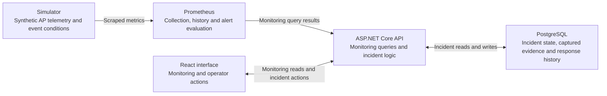

# Milestone 6 — Incident Triage and Response

## Purpose and what changed

Milestone 6 converts meaningful monitored network conditions into durable, operator-managed response records. It demonstrates domain rules, transactional persistence, explicit state transitions, concurrency control, retry safety, asynchronous UI ownership and failure recovery. Networking and observability provide the software application's domain.

The work adds PostgreSQL incident persistence; investigation, monitoring, resolution and reopening; notes and responder/team labels; bounded incident discovery; and a React list/detail/workflow experience. Current monitoring and immutable incident-opening evidence remain visibly separate.

## Alert versus incident

An **alert** is a machine-detected technical condition. An **incident** is a durable record of the human response to a meaningful condition, including why the record was opened and what actions the application recorded.

Creation is operator-driven. An alert does not automatically create an incident, and a qualifying offline/degraded condition can support creation before an alert becomes active. Alert severity describes technical monitoring; it does not establish business impact or incident priority.

## Monitoring and incident architecture



Monitoring and incident responsibilities share **one ASP.NET Core API application**. Blackbox separately probes its local HTTP liveness endpoint; it does not measure wireless quality.

**Prometheus owns** current monitoring measurements, time-series history, rule evaluation and alert state. **PostgreSQL owns** incident identity, current response state, immutable opening context, workflow chronology and retry/concurrency application state. Incident persistence does not duplicate the Prometheus time series. The API reads alert states; it does not trigger Prometheus alerts.

Monitoring exposes AP/zone identity, operational/degraded state, clients, utilization, management latency/loss, separate `VenueApDown` and `VenueApDegraded` states, and AP history. The existing five-second overview poller also supplies the incident detail's current-network section. Incident discovery/detail use explicit loading and refresh rather than another polling loop.

## Synthetic versus real behavior

AP measurements, client counts, utilization, management latency/loss and simulator network conditions are **synthetic inputs**. Prometheus scraping/rules, ASP.NET validation, PostgreSQL persistence/transactions, EF migrations, concurrency checks, retry/idempotency handling, browser request ownership, incident workflow, dependency failure/recovery and local Docker networking are **real application behavior** operating on those inputs.

The project contains no real Javits telemetry, incident process, responder identity or wireless-controller data. It is not a ServiceNow replacement, venue-capacity prediction or production-deployment claim. The deterministic conditions used here are described in [Milestone 5](milestone-5.md).

## Captured evidence versus current telemetry

**Captured evidence explains why the incident was opened. Current telemetry shows what monitoring reports now.** Captured evidence remains unchanged when measurements recover, alerts clear, the simulator resets or workflow state changes.

`monitoringEvidence` contains `capturedAtUtc`, `generatedAtUtc` and selected `accessPoints`. Each AP preserves identity/zone, operational/degraded state, clients, nullable utilization/management latency/management loss, source, `observedAtUtc`, both alert states and any active `downAlert`/`degradationAlert` occurrence. Occurrences have explicit name, state, severity, telemetry source, AP/zone and observation time; there is no unrestricted label dictionary. No active occurrence is a valid snapshot. Unavailable measurements remain distinct from numeric zero.

Opening evidence preserves validated monitoring results captured during creation. **It is not an atomic same-scrape snapshot or an exact incident-onset timestamp.** Capture uses multiple Prometheus queries; their observation timestamps, the generated response timestamp, server capture time and incident creation time have different meanings. Prometheus history retains real monitoring time, not synthetic event-day labels.

## Incident lifecycle

| Current state | Allowed next states |
|---|---|
| Open | Investigating, Monitoring, Resolved |
| Investigating | Monitoring, Resolved |
| Monitoring | Investigating, Resolved |
| Resolved | Investigating |

Monitoring is optional. Resolution is a human decision: telemetry recovery never automatically resolves an incident, and renewed degradation never automatically reopens it. No transition returns to Open.

Resolution and reopening require explanatory text. Resolution sets `resolvedAtUtc`; reopening clears the current value while retaining earlier resolution chronology. Notes remain allowed after resolution. Responder changes require an unresolved incident; changing to the same normalized label is rejected.

The optional responder/team label is unverified free text, not authenticated assignment. Notes and labels are trimmed, with note/transition-text limits of 2,000 characters and responder-label limit of 100. Limits are checked before trimming. Blank responder input clears the label.

## Relational responsibilities

| Table | Responsibility |
|---|---|
| `Incidents` | Identity, immutable title/zone, current status/responder/version, creation/capture/resolution timestamps and optional creation key |
| `IncidentAccessPoints` | Immutable selected AP associations and captured technical context |
| `IncidentEvents` | Append-only Created, note, status-change and responder-change chronology, including workflow command identity |

Creation commits the incident, all AP contexts and its Created event atomically. Each accepted workflow action commits current state/version and its explanatory event in the same transaction. Event sequence starts at 1 and advances with incident version. Application events record what was recorded and when; without authentication they do not prove who performed the action or provide tamper-proof attribution.

PostgreSQL generates bigint incident identities. Display numbers use `INC-` with a minimum six-digit width, such as `INC-000001`; sequence gaps are allowed. See the [model](../src/VenueOps.Api/Incident.cs), [mapping](../src/VenueOps.Api/IncidentDbContext.cs) and [migrations](../src/VenueOps.Api/Migrations).

## Creation and discovery

`POST /api/incidents` accepts human intent only: `title`, `accessPoints` containing `apId` and `expectedCondition`, optional `responderLabel`, and optional `creationCommandId`. The server owns zone, status, measurements, alert evidence and timestamps; client-authored telemetry is rejected.

Title must contain non-whitespace text and be at most 200 characters. Select one–four unique APs, all in one server-inferred zone. Expected condition is exactly `offline` (`operational == false`) or `degraded` (`operational == true && degraded == true`). Fresh creation requires validated current monitoring matching every selected condition.

Successful first creation and matching keyed replay return **201 Created**, the same `/api/incidents/{id}` Location and current stored detail. A changed current condition returns **409 `condition_changed`**. Reusing a committed creation key for different original intent returns **409 `creation_command_conflict`**. Invalid input returns 400; unavailable required monitoring/storage returns bounded 503 Problem Details.

`GET /api/incidents` supports optional `status`, `zone` and `beforeId`:

- Status is one of the exact lifecycle names; zone is an exact bounded string. Blank, oversized and NUL-containing zone values are invalid; a well-formed unknown zone returns an empty page. Combined filters use AND.
- Results use `Id DESC`, a fixed maximum of 50, and the exclusive positive cursor `Id < beforeId`. The database retrieves at most 51 projected summaries to determine whether more exist.
- Response fields are `items`, `hasMore`, `nextBeforeId`. When more exist, the next cursor is the lowest ID returned; otherwise it is null.
- Summary fields are `id`, `number`, `title`, `status`, `zone`, `responderLabel`, `createdAtUtc`, `resolvedAtUtc`, `version`, `affectedAccessPointCount`. They exclude evidence, chronology and command receipts. No total count is calculated.

This is stable identity-based traversal, not guaranteed transaction-commit order or a frozen snapshot across requests. Refreshing the first page discovers newer incidents. Current workflow changes appear on fresh requests.

## Incident detail and chronology

`GET /api/incidents/{id}` returns current application state, `monitoringEvidence`, `version`, `resolvedAtUtc`, `events`, `hasEarlierEvents` and `nextBeforeEventSequence`, alongside identity/title/zone/responder/creation time. Unknown incidents return 404.

Each response captures current incident state/version before selecting its eligible events. It returns the newest page of up to 100 events in ascending sequence order for display, excluding events beyond that captured version. Optional positive `beforeEventSequence` is exclusive and retrieves earlier activity. Loading earlier activity does not replace current incident state with an older command receipt.

## Workflow operations

| Operation | Endpoint | Command fields beyond identity/version |
|---|---|---|
| Add note | `POST /api/incidents/{id}/notes` | `text` |
| Change state, resolve or reopen | `POST /api/incidents/{id}/transitions` | `status`, optional `note` (required for resolve/reopen) |
| Change/clear responder | `PUT /api/incidents/{id}/responder` | Required `responderLabel`, nullable |

Each command requires a nonempty UUID `commandId` and positive `expectedVersion`. Success returns 200 with `{incidentId, commandId, version, event}`. Workflow conflicts return 409 with `code`, `currentVersion` and `currentStatus`: `version_conflict`, `state_conflict`, `command_conflict` or `responder_unchanged`. Validation remains 400 and unknown incident remains 404. See [contracts](../src/VenueOps.Api/IncidentContracts.cs) and [workflow rules](../src/VenueOps.Api/IncidentWorkflow.cs).

## Idempotency

### Creation

A nonempty `creationCommandId` is globally unique across incident creation. Replay compares normalized title, the original Created-event responder, and immutable AP identities/expected conditions regardless of AP order. It does not compare today's mutable responder, workflow state or monitoring. Different keys can create separate incidents with identical intent; this is retry deduplication, not incident correlation.

Matching replay returns the same incident's **current stored detail** without another graph/event, version increment or evidence capture. Failed creation reserves no key. Omitted or explicitly null keys preserve legacy non-idempotent behavior and are not retry-safe.

### Workflow

`commandId` is scoped to an incident. Matching replay returns the **original immutable command receipt**, even after later actions. Reusing that command ID for different intent conflicts.

Creation retries discover the incident that was created; workflow retries confirm the specific action already committed. Their response semantics intentionally differ. [IncidentService](../src/VenueOps.Api/IncidentService.cs) implements both without holding a database transaction open during monitoring capture.

## Optimistic concurrency

The incident has a version; workflow callers submit `expectedVersion`. A stale new command returns **409 `version_conflict`** rather than overwriting newer decisions. The frontend refetches current state, preserves the operator's draft and requires review before a new command identity is submitted. It does not silently rebase or auto-retry a conflicting action.

## Browser uncertain outcomes

The browser saves the exact mutation identity/payload in `sessionStorage` before dispatch. A lost response does not prove rollback. Reload never automatically POSTs; the operator explicitly retries the same saved request. Definitive rejection requires review, while a confirmed action remains confirmed if its later detail refresh fails.

This recovery is limited to the browser session; it is not cross-tab/device coordination or durable server draft storage. Unsent drafts live in application memory and do not have the same reload guarantee. Unavailable/corrupt retry storage blocks unsafe fresh dispatch.

List/detail/earlier-activity reads use cancellation plus lifecycle/request ownership. An obsolete response cannot take over newer navigation or refresh state, including returning to the same identity after visiting another view. See [request state](../src/VenueOps.Web/src/incidentRequestState.ts).

## Dependency boundaries

| Unavailable dependency | Available behavior | Affected behavior |
|---|---|---|
| Prometheus | Stored list/detail/workflow and matching committed creation replay | Fresh capture-dependent creation cannot validate current conditions and returns 503 |
| PostgreSQL | Process liveness and monitoring when Prometheus is healthy | Incident persistence operations return scoped 503 |

`/health/live` reports process liveness. `/health/ready/incidents` checks incident storage connectivity and expected schema availability independently. Recognized provider/storage failures are mapped narrowly; unrelated application exceptions are not all converted into 503. No memory/file/database fallback substitutes for unavailable storage.

## Database lifecycle

PostgreSQL 18 uses the dedicated `incident-data` named volume mounted at `/var/lib/postgresql`. Its normal port is not host-published; the API connects over the Compose network. The Prometheus volume and retention remain separate.

Before first initialization, configure a private ignored `.env` using [.env.example](../.env.example), choose a local-only `VENUE_INCIDENT_DB_PASSWORD`, and restrict the file to mode `0600`. Never commit it or expose it through frontend configuration. For an initialized incident volume, retain the same credential. Changing `.env` alone does not rotate PostgreSQL's stored role password; an explicit database password rotation must be coordinated separately.

EF migrations are reviewed, explicit schema changes. Ordinary API startup does not auto-create/migrate schema or wait in a migration retry loop. After initial stack setup or a schema upgrade, from the repository root:

```bash
docker compose --project-name venue-network-operations-console \
  --file compose.yaml exec -T venue-api \
  dotnet VenueOps.Api.dll --migrate-incidents
```

Current schema history is InitialIncidents → IncidentResponseWorkflow → IncidentCreationIdempotency. Reapplying the current migration set is a no-op. The endpoint readiness check is distinct from migration execution.

## How to demonstrate

### Isolated browser demonstration

For an already-provisioned checkout with the normal stack healthy and normal incident storage empty, run the existing verifier from the repository root:

```bash
VENUE_M6_EVIDENCE="$(mktemp -d "${TMPDIR:-/tmp}/venue-m6-demo-XXXXXX")"

bash tests/milestone6/verify-ui.sh \
  --evidence-dir "$VENUE_M6_EVIDENCE/ui"
```

It uses the existing API image, temporary incident database/role/API, temporary Vite/proxy and installed Chrome with an owned profile. Chrome runs headless; screenshots and sanitized raw evidence stay outside Git. It exercises the operator workflow and removes temporary resources without adding normal incident rows. There is no interactive/keep-open mode. Normally collected Prometheus demonstration samples remain under ordinary retention; they are not erased as cleanup.

The current local verifier expects Node 22.23.2 on `PATH` and Chrome at its standard macOS application path. It checks the version of the Node process executing the verifier. No browser tooling or dependency installation is part of this demonstration.

### Normal interactive use

**Using normal incident storage creates durable application data.** Resolving an incident or resetting the simulator does not delete it. Use the isolated verifier when no normal incident rows should remain; no delete workaround is provided.

With maintained Node 22.23.2, dependencies/images already provisioned, private credentials preserved and migrations current, start services only if needed:

```bash
docker compose --project-name venue-network-operations-console \
  --file compose.yaml up --no-build --pull never --detach --wait
```

Start the frontend in a separate terminal:

```bash
COREPACK_ENABLE_NETWORK=0 \
corepack npm@11.19.1 --prefix src/VenueOps.Web run dev -- \
  --host 127.0.0.1 --port 5173 --strictPort
```

Open <http://127.0.0.1:5173>. Hold a deterministic Zone A condition:

```bash
curl --fail --silent --show-error -X PUT \
  -H 'Content-Type: application/json' \
  --data '{"elapsedMinutes":360}' \
  http://127.0.0.1:8081/simulation/event-day/position
```

Wait for monitoring to collect degradation, then:

1. Use Zone A's **Create incident** action; review the frozen AP scope and title.
2. Set a responder/team label, start investigating and add a note.
3. Reset the simulator using the command below. Wait for current telemetry to become healthy; captured evidence stays degraded and the incident remains Investigating.
4. Move to Monitoring, resolve with a reason and reload. Optionally reopen with a reason and inspect retained chronology.
5. Inspect discovery/detail, then reset the simulator again when finished.

```bash
curl --fail --silent --show-error -X POST \
  http://127.0.0.1:8081/simulation/event-day/reset
```

The incident demo needs no 11-minute automatic run. Scenario controls remain simulator API controls.

## Verification evidence

Observed during closeout against commit `144e7afe4b8df2200daa09c5380cd41bb0def084`: regression and the four hosted verifiers passed on **2026-09-13 UTC**; the corrected disposable backup proof completed on **2026-09-14 at 00:26:33 UTC**, with final preservation confirmed at **00:27:33 UTC**. The previously passed gates were retained without rerunning them for the temporary backup-comparison correction. Counts and timings below describe these runs, not permanent product guarantees. No application, migration, test or tracked verifier behavior changed during closeout.

### Unit/component regression

| Check | Observed result |
|---|---|
| `dotnet test VenueNetworkOperationsConsole.sln --no-restore` | 388 passed: API 291, simulator 97; zero skipped |
| Frontend tests, maintained Node 22.23.2 / Corepack npm 11.19.1 | 195 passed |
| Frontend lint / production build | Both passed, with Corepack network access disabled |
| Documentation diff whitespace check | Passed |

Deterministic tests establish domain/validation rules, replay contracts and controlled asynchronous ownership, including A → B → A navigation and abort-resistant late completions. Those adversarial component cases are distinct from the rendered-browser observations below.

### Prometheus rule tests

The running configuration and all four production rules validated. The unchanged [Milestone 5 fixture](../tests/milestone5/venue.rules.test.yml) passed **27 assertions in three groups** using the existing pinned Prometheus image without pulling. Virtual-time evaluation proves alert conditions/durations; it is separate from hosted observation timing.

### EF/model verification

`dotnet ef migrations has-pending-model-changes --project src/VenueOps.Api --no-build` reported no pending model changes. Hosted migration checks preserved nonempty legacy data and proved repeated migration application is a no-op. Normal incident storage already had all three migrations; it was not migrated or recreated merely for closeout evidence.

### Real PostgreSQL hosted verification

All four existing verifiers ran **once each, sequentially**, against isolated incident storage and the accepted API image:

| Verifier | Representative observed proof |
|---|---|
| [Persistence](../tests/milestone6/verify.sh) | Offline and multi-AP capture, atomic creation, unchanged evidence after recovery, API-restart durability, dependency boundaries |
| [Workflow](../tests/milestone6/verify-workflow.sh) | Nonempty Task 1 migration, real command concurrency, immutable receipts, transaction rollback, 126-event chronology and bounded traversal |
| [Discovery](../tests/milestone6/verify-discovery.sh) | Nonempty Task 2 migration, identical concurrent creates returning one identity, conflicting intent, capture-failure winner recovery, rollback/key reuse, 66 isolated incidents with cursor/filter checks |
| [Operator UI](../tests/milestone6/verify-ui.sh) | Actual Chrome/API/PostgreSQL workflow, response loss/retry, stale-version review, dependency recovery, earlier-activity ownership and bounded polling |

Workflow/discovery migration proofs require retained local images from their respective earlier schema versions through `--legacy-api-image`; they do not silently skip compatibility checks when those images are missing. These are local verification prerequisites, not published registry images. Each verifier's cleanup succeeded; bulk/demo incidents were never inserted into normal storage.

### Browser/operator verification

Installed Chrome rendered the desktop operator journey: Zone A creation → responder → investigation/note → monitoring recovery → Monitoring → resolution → reload → reopening. Screenshots showed captured degraded evidence alongside current healthy telemetry and retained resolution/reopening chronology.

Response-stage interception lost successful creation and workflow responses after commit. Explicit same-request replay recovered them without duplicate work; creation replay also succeeded while monitoring was unavailable. A second-client version conflict retained the draft, fetched current state and required review. The 107-event detail exercised earlier-page loading and rejection of an obsolete earlier response after refresh.

The **390×844** viewport passed the horizontal-overflow assertion. Inspected screenshots showed text status labels, labelled forms, a numbered activity list and a visible incident-heading focus outline. Two overview polls were observed in an 11-second bounded-polling window without a catch-up burst. This is Chrome-only rendered evidence, not a comprehensive keyboard audit or WCAG certification.

### Dependency failure/recovery

With Prometheus inaccessible only to the isolated API, stored list/detail/workflow and committed creation replay remained usable while fresh capture-dependent creation returned bounded 503. With isolated PostgreSQL role access disabled and active connections terminated, incident operations returned scoped 503, process liveness stayed 200 and monitoring continued. Access restoration recovered stored state and workflow. The browser displayed scoped incident-storage failure while Monitoring remained usable, then recovered through explicit navigation/refetch.

### Backup/restore proof

A disposable PostgreSQL incident database was dumped and restored into a **separate, initially empty disposable database** using PostgreSQL 18.6 tooling. The mode-0600 custom archive used `--no-owner --no-privileges`; restoration used `--single-transaction --exit-on-error` with the temporary owner role. The target was not pre-migrated and no normal database or volume was overwritten.

Source data comprised two incidents, three AP contexts and nine events: a keyed multi-AP degradation incident with responder change, investigation, note, monitoring, resolution and reopening; and a currently resolved outage preserving zero clients, unavailable measurements and its resolution timestamp. All durable rows, captured alert evidence, UUIDs, timestamps, versions, chronology and migration history matched after restore. Columns/defaults/nullability, primary/foreign keys, indexes and both identity-sequence states also matched.

PostgreSQL may deparse equivalent CHECK expressions differently after logical dump/restore. Closeout therefore compared all five CHECK constraints' structure/properties and behavior rather than requiring byte-identical SQL rendering. Both rendered definitions were retained for inspection. Each database passed the same **34 probes**: 19 rolled-back row updates covering all four valid statuses, an invalid status, and accepted/rejected event-kind/sequence/command-ID combinations; plus 15 evaluations of the installed version, resolution and sequence predicates on typed virtual rows. Probes left rows and identity sequences unchanged.

The restored API's liveness/readiness, list and detail matched the source. Both original keyed creates replayed with the same identity/current detail, and all seven saved workflow commands replayed their original immutable receipts without extra events or version increments. A new note advanced the reopened incident from version 7 to 8, and a new incident received ID 3 with valid AP context and Created chronology. New global event IDs 10 and 11 demonstrated usable identities without sequence repair.

Both disposable databases, the role, APIs, temporary credentials, controller and archive were removed. This establishes local logical backup/restore and application-write viability. It does not establish a backup schedule, production policy, disaster recovery, role/secret or off-site backup, or RPO/RTO.

### Infrastructure preservation

The exact original fixed query for `venue_ap_operational{ap_id="ap-001"}` was repeated after the corrected proof with the same absolute bounds and five-second step. Its one series and 25 range positions had identical labels, timestamps and values. These are range-query observations, not a claim of one-to-one raw scrape counts. Normally collected demonstration history remains subject to unchanged seven-day retention.

Final normal storage remained **0 incidents / 0 AP contexts / 0 events**, with all three migrations applied and readiness healthy. Five normal services were running/unpaused; configured healthchecks, five Prometheus targets and Blackbox probing were healthy. The simulator returned exact immutable baseline measurements, all AP scenarios healthy and both alerts inactive. Normal container/image/network identities, volumes/mounts, four IPv4-loopback publications, unpublished PostgreSQL and the private `.env` fingerprint/mode were preserved. No owned temporary API, database, role, browser, Vite, profile, controller, credential material or backup archive remained. Raw evidence/screenshots stayed outside Git.

## Limitations

- Network inputs are synthetic; incidents are operator-created, with one-zone immutable initial AP scope and no retrospective creation.
- There is no authentication/RBAC or verified responder identity, automatic correlation, external service-management integration, notifications, SLA/escalation, attachments or chat.
- Browser retry state is same-session only, without cross-tab coordination. Rendered verification covers Chrome, not a cross-browser matrix or comprehensive accessibility certification.
- Cursor traversal is not a frozen database snapshot. UI zone choices reflect the current fixed simulator inventory.
- Simulator event state is process-local and non-persistent. Captured monitoring context is not exact onset time or atomic same-scrape telemetry.
- The project makes no production security/deployment claim. Disposable logical backup/restore verification establishes local viability, not scheduled backups, production disaster recovery, or RPO/RTO.
